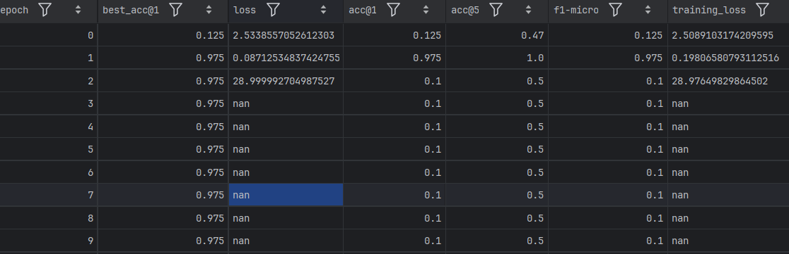
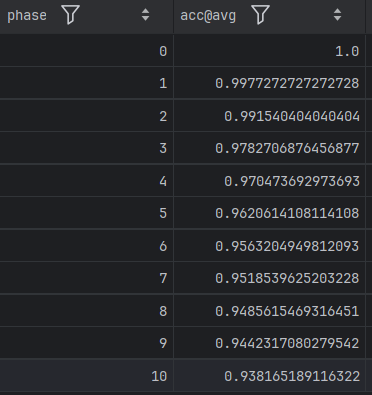
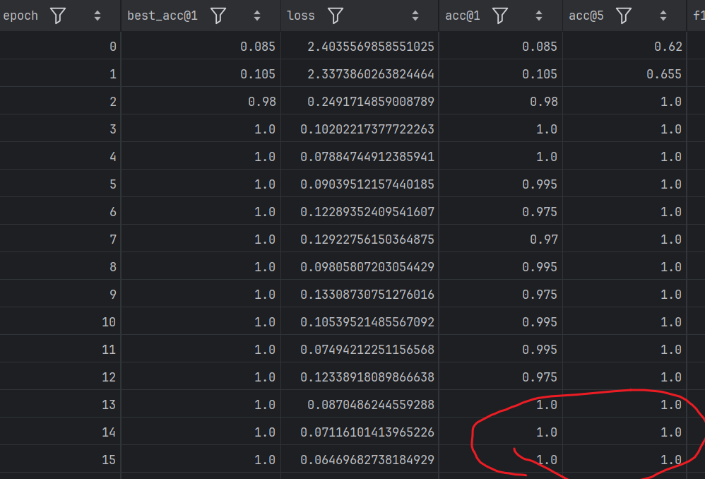
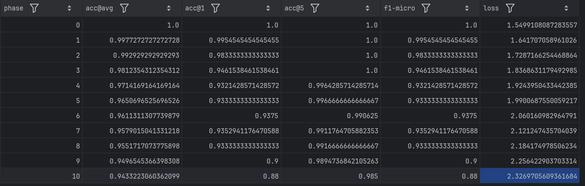

# 我的README
- 本仓库是庄老师的持续学习仓库，做课设时把项目存到我的仓库并且改名为ACIL_learning
- 重点解析公式！！！  
  - 权重W求解：对应最小二乘解析解，多了一个λ项，λ是正则化系数/惩罚系数，中间的函数带L2正则化项->岭回归
  
  - 递归公式（每次新类进入时使用递归求解）：
  
- 能够避免侵犯隐私（虽然历史样本信息保存R，但是无法根据R逆向推出原始样本，保护隐私）
  - 通俗理解：  
    如果把AI比作一个学生，传统的数据回放就是该学生必须把旧课本（历史数据）时刻带在身边，复习时拿出来翻看。  
    而R相当于该学生把之前所有课本内容提炼成了一张“知识精华思维导图”。学新课时，学生不再需要翻旧课本，只需要看着这张导图，就能保证新学的知识不会覆盖旧知识。 
- 神经网络输出：$Y =f_{softmax}(f_{flat}(f_{CNN}(X,_{WCNN}))W_{FCN})$

## 一、环境配置
- 1、创建虚拟环境
    ```
    conda env create -f environment.yaml
    conda activate AL
    ```
  2、项目可以在GPU上运行，也可以在CPU上运行。我的电脑显卡版本太高了，得用其它版本torch。

## 二、例程
### 1、执行老师的例程命令：
  ```(bash)
  python main.py ACIL ^
  --dataset CIFAR-100 ^
  --base-ratio 0.5 ^
  --phases 25 ^
  --data-root ~/dataset ^
  --IL-batch-size 4096 ^
  --num-workers 16 ^
  --backbone resnet32 ^
  --gamma 0.1 ^
  --buffer-size 8192 ^
  --cache-features ^
  --backbone-path ./backbones/resnet32_CIFAR-100_0.5_None
   ```

### 2、main(load_args())中传入的参数：
   ``` txt
   {
     'method': 'ACIL',
     'exp_name': 'ACIL',
     'cpu_only': False,
     'gpus': None,
     'dataset': 'CIFAR-100',
     'data_root': 'C:\\Users\\wang/dataset\\CIFAR-100',
     'num_workers': 16,
     'base_ratio': 0.5,
     'phases': 25,
     'batch_size': 256,
     'cache_features': True,
     'backbone': 'resnet32',
     'cache_path': './backbones/resnet32_CIFAR-100_0.5_None',
     'seed': None,
     'dataset_seed': None,
     'base_epochs': 300,
     'warmup_epochs': 10,
     'learning_rate': 0.5,
     'momentum': 0.9,
     'weight_decay': 0.0005,
     'separate_decay': False,
     'label_smoothing': 0.05,
     'IL_batch_size': 4096,
     'gamma': 0.1,
     'buffer_size': 8192,
     'gamma_comp': 0.1,
     'sigma': 10,
     'compensation_ratio': 1,
     'backbone_path': './backbones/resnet32_CIFAR-100_0.5_None\\backbone.pth',
     'saving_root': 'saved_models\\resnet32_CIFAR-100_0.5_None\\ACIL\\2026-05-17T14-08-26',
     'argv': "['main.py', 'ACIL', '--dataset', 'CIFAR-100', '--base-ratio', '0.5', '--phases', '25', '--data-root', '~/dataset', '--IL-batch-size', '4096', '--num-workers', '16', '--backbone', 'resnet32', '--gamma', '0.1', '--buffer-size', '8192', '--cache-features', '--backbone-path', './backbones/resnet32_CIFAR-100_0.5_None']"
   }
   ```
  


## 三、我的代码
### 3.1 课程作业要求：
  - 要求：
    1. 您只能使用数据集的前半部分来强化骨干网络。在增量学习过程中使用该数据集会导致数据泄露，并且得出的结果也不会令人信服。
    2. 这个项目需要团队合作。你应该找一个由 3 至 5 名学生组成的小组，并一起开展工作。
    3. 将 ACIL 用作增量学习的基准。您应当使用另外一半类别来与 ACIL 进行增量学习，以便进行公平的比较。
    4. 在本次任务中，推荐使用加州大学梅尔森分校的土地利用数据集。
    5. 该模型架构推荐采用 ViT-B_16。由于本项目旨在强化骨干网络，直接使用参数更多的其他骨干网络可能会有效，但不够优雅。此外，参数较少的骨干网络训练速度更快。
    6. 需要完成一份 5 页的项目报告以及一个配有幻灯片的口头报告。 报告和幻灯片都应使用英语，报告应按照模板撰写。口头报告可以用中文。
  - 一些细节说明：
    1. 每个类别有 100 张图片，后 20 张作为测试集
    2. 训练 protocol 为 base phase 训练 11 类，后续每个 phase 训练 1 类（一共21类）
    3. oral presentation 限制在 5 分钟内
    后续结合大家的反馈补充

### 3.2 我的代码实现：
- 0、将老师给的图像数据集放到./my_dataset目录下，数据集结构如下：
  ```
  my_dataset
  ├── UCMerced_LandUse
      ├── Images
          ├── class1
              ├── img1.jpg
              ├── img2.jpg
              ...
          ├── class2
              ├── img1.jpg
              ├── img2.jpg
              ...
          ...
  ```
  
- 1、执行命令：
    ```(bash)
    python main.py ACIL ^
    --dataset UCMerced_LandUse ^
    --base-ratio 0.5238095238 ^
    --phases 10 ^
    --data-root ./my_dataset ^
    --batch-size 16 ^
    --num-workers 4 ^
    --backbone vit_b_16 ^
    --learning-rate 0.5 ^
    --label-smoothing 0.05 ^
    --base-epochs 300 ^
    --weight-decay 5e-4 ^
    --gamma 0.1 ^
    --buffer-size 2048 ^
    --cache-features ^
    --IL-batch-size 64 ^
     ```
  - 注意： 
    1. --dataset UCMerced_LandUse(需要修改为自己的数据集)
    2. --base-ratio 0.5238095238(需要修改为 -> 11/20 ≈ 0.5238095238)
    3. --phase 10(需要修改为10次增量学习阶段) 
    4. --backbone vit_b_16(需要修改为vit_b_16模型架构)
    5. --seed 520(设置随机数种子，保证结果可复现)
    6. --dataset-seed 520(设置随机数种子，保证结果可复现)
    7. --num-workers 4(根据自己的计算资源调整数据加载的线程数、window运行设置低一点？)
    8. --IL-batch-size 64(根据自己的计算资源调整增量学习阶段的批量大小，我的只有8GB显存，设置为64)
    9. --buffer-size 2048(根据自己的计算资源调整缓冲区大小，我的只有8GB显存，设置为2048)
    10. --batch-size 16(根据自己的计算资源调整训练阶段的批量大小)
  
  - 保存到了./saved_models/vit_b_16_UCMerced_LandUse_0.5238095238_None/ACIL/2026-05-19T00-56-05文件夹

- 2、UCMerced.py
  - 写了一个UCMerced_LandUse_类用于目标数据集，继承DatasetWrapper，实际上是一个数据集包装器，主要功能是加载数据集并进行预处理。
  - 主要功能：
    - _subset、subset_at_phase、subset_until_phase：根据情况返回数据集的子集，确保每个阶段使用特定类别的数据。
    - basic_transform：基本的图像预处理方法，包括调整大小、中心裁剪和归一化等。（做测试集时采用）
    - augment_transform：数据增强方法，包含随机裁剪、水平翻转和颜色抖动等。（做训练集时采用）

- 3、结果
  - 感觉数据预处理好花时间。
  - 我运行的的base_trainning有问题，训练过程的loss从第几步开始全是nan了，可能是std和mean设置不对？还是我的学习率太高0.5？  
    如图我的结果居然第二次训练就达到了0.975的准确率，是刚好运气好吗？第三次开始训练的损失就变得特别大，第四次就直接NAN了，真的可能是学习率太高？直接发散了
    - 
  - 验证结果：将saved的模型保存到./backbones目录下，因为之前的运行有错误，所以--cache-features缓存的特征也是错误的，导致增量学习阶段的训练也有问题，所以先不要使用--cache-features
    ```(bash)
    python main.py ACIL ^
    --dataset UCMerced_LandUse ^
    --base-ratio 0.5238095238 ^
    --phases 10 ^
    --data-root ./my_dataset ^
    --IL-batch-size 64 ^
    --num-workers 4 ^
    --backbone vit_b_16 ^
    --gamma 0.1 ^
    --buffer-size 2048 ^
    // --cache-features ^
    --backbone-path ./backbones/vit_b_16_UCMerced_LandUse_0.5238095238_None
    ```
    - 结果如下：./saved_models/vit_b_16_UCMerced_LandUse_0.5238095238_None/ACIL/2026-05-19T11-13-02文件夹
      - 

- 4、修改UCMerced.py的标准差和均值
  - .\my_dataset\UCMerced_LandUse\calculate_std_mean.py
  - 发现与之前的标准差和均值很接近，所以觉得可能是learning-rate的问题？
  - 修改标准差和均值以及learning-rate:
  - 0.5 -> 0.05：./saved_models/vit_b_16_UCMerced_LandUse_0.5238095238_None/ACIL/2026-05-19T11-37-24
  - 感觉还是太高了：改成0.05 -> 0.005：./saved_models/vit_b_16_UCMerced_LandUse_0.5238095238_None/ACIL/2026-05-19T12-24-51
  - 0.005 -> 0.001：./saved_models/vit_b_16_UCMerced_LandUse_0.5238095238_None/ACIL/2026-05-19T12-24-51
    ```(bash)
    python main.py ACIL ^
    --dataset UCMerced_LandUse ^
    --base-ratio 0.5238095238 ^
    --phases 10 ^
    --data-root ./my_dataset ^
    --batch-size 16 ^
    --num-workers 4 ^
    --backbone vit_b_16 ^
    --learning-rate 0.001 ^
    --label-smoothing 0.05 ^
    --base-epochs 300 ^
    --weight-decay 5e-4 ^
    --gamma 0.1 ^
    --buffer-size 2048 ^
    --cache-features ^
    --IL-batch-size 64 ^
     ```
  - 结果如下：几轮之后就达到了1.00的准确率，就不继续训练了，应该是数据集比较小，速度较快
    - 
  - 再进行验证：
    ```(bash)
    python main.py ACIL ^
    --dataset UCMerced_LandUse ^
    --base-ratio 0.5238095238 ^
    --phases 10 ^
    --data-root ./my_dataset ^
    --IL-batch-size 64 ^
    --num-workers 4 ^
    --backbone vit_b_16 ^
    --gamma 0.1 ^
    --buffer-size 2048 ^
    // --cache-features ^ 因为还没有进行特征缓存，所以先不要使用--cache-features
    --backbone-path ./backbones/vit_b_16_UCMerced_LandUse_0.5238095238_None
    ```
  - 最终结果如下：
    - 


### 3.3 代码解读：
- 1、ACIL类就是在骨干网络后的分类器进行解析解的模块网络
  - self.buffer = RandomBuffer(backbone_output, buffer_size, **factory_kwargs)：RandomBuffer层它不学习，不更新，只“缓存”一个固定的随机映射矩阵。
  - self.analytic_linear = linear(buffer_size, gamma, **factory_kwargs)：AnalyticLinear层进行解析式线性分类。
  - AnalyticLinear层->继承自线性层不使用反向传播，解析式持续学习的重要部分！out_features 是动态增长的。fit方法实现了增量学习的核心逻辑，使用当前批次的数据更新解析式线性层的权重。

- 2、ACILLearner类继承自Learner类，主要实现了增量学习的训练过程：
  - base_training：用常规监督学习训练骨干网络，载入ViT-B_16架构，并且只使用（11/21）类数据。  
    每个epoch：训练时对训练集进行了一次训练加一次验证式评估，对验证集进行一次评估，最后得到best_acc保存最好的一个。
  - make_model：创建ACIL模型，载入预训练的骨干网络权重，并且冻结骨干网络的参数。（隐式的冻结：ACIL.__init__末尾调用self.eval()，且所有方法使用@torch.no_grad()装饰，因此增量学习阶段不会更新骨干网络参数）
  - learn：增量学习阶段的训练过程，遍历数据加载器，对每个batch调用self.model.fit(X, y),用当前batch更新解析式线性层，这就是ACIL的增量更新逻辑。（注意：虽然传入了increase_size参数，但ACIL.fit()并未将其传递给底层RecursiveLinear.fit()——RecursiveLinear通过one-hot标签的shape自动判断新增类别数，increase_size在当前实现中实际被忽略。）
  - before_validation：在进行验证前，调用self.model.update()。对于RecursiveLinear（本配置使用），update()仅做数值稳定性断言检查（assert torch.isfinite），真正的权重更新已在fit()中完成。对于GeneralizedARM变体，update()才会计算最终的权重矩阵（本配置未使用）。
  - inference：在验证阶段，使用ACIL模型进行推理，得到预测结果。
  - wrap_data_parallel：如果使用多GPU训练，使用DataParallel包装ACIL模型。（没用到）

- 3、增量学习阶段的数据使用：
  - 启用--cache-features时：base_training后会将所有数据通过backbone提取特征并保存为.pt文件，然后用Features数据集加载缓存的特征，backbone替换为nn.Identity()，增量学习阶段直接使用缓存的backbone特征而非原始图像。
  - 未启用--cache-features时：每个phase重新通过backbone处理原始图像。
  - 训练/测试范围：for phase in range(0, args["phases"] + 1)中，train_subset = subset_at_phase(phase)只取当前phase的新类别数据，test_subset = subset_until_phase(phase)取所有已见过类别的数据。

- 4、整个流程：
  - base_training阶段构建了一个普通的 backbone + Linear 模型，用标准 SGD + CrossEntropyLoss 训练。全程没有用到 ACIL（RandomBuffer + AnalyticLinear）。ACIL 模型是在 base_training 结束后，由第216行 self.make_model() 才创建的。
  - 增量学习阶段（phase 0）：Phase 0 称为 Re-align（重对齐），它用全部11个基类数据初始化 ACIL 的解析式线性层。原因是：骨干网络是用 SGD 训练的，现在需要把它的特征空间"迁移"到 ACIL 的解析式分类器上。
  - 增量学习阶段（phase 1-10）：增量学习阶段只用新类数据、没用旧类数据。
  - 完整流程：
    ```txt
    base_training:  backbone + Linear, SGD训练, 用11个基类
        ↓
    Phase 0 (Re-align):  用11个基类数据 → 初始化ACIL的RecursiveLinear
        ↓
    Phase 1:  用1个新类数据 → ACIL增量更新权重（R矩阵保留旧知识）
        ↓
    Phase 2~10:  同上，每次1个新类
    ```
- 5、关键机制：
  - 虽然每个 phase 只用新类数据训练，但 ACIL 通过 RecursiveLinear 中的 R 矩阵（Regularized Feature Autocorrelation Matrix）保留了所有历史类别的统计信息。新类来时，通过 AnalyticLinear.py:124-128 的矩阵运算公式同时更新 R 和权重，旧类知识不会灾难性遗忘——这正是 ACIL "解析式持续学习"的核心优势。

## 四、ClaudeCode解析代码
- [CODE_ANALYSIS-MarkDown文档](CODE_ANALYSIS.md)