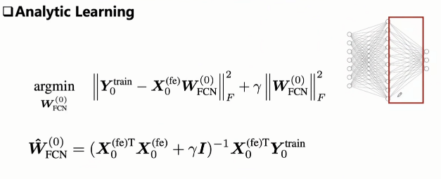
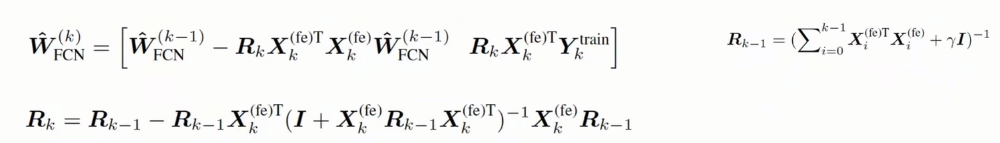

# 我的README
- 本仓库是庄老师的持续学习仓库，做课设时把项目存到我的仓库并且改名为ACIL_learning
- [深度学习课设任务要求.pdf](<Deep Learning Project 2026 Spring_PostGraduate.pdf>)
- 重点解析公式！！！  
  - 权重W求解：对应最小二乘解析解，多了一个λ项，λ是正则化系数/惩罚系数，中间的函数带L2正则化项->岭回归
  
  - 递归公式（每次新类进入时使用递归求解）：
  
- 能够避免侵犯隐私（虽然历史样本信息保存R，但是无法根据R逆向推出原始样本，保护隐私）
  - 通俗理解：  
    如果把AI比作一个学生，传统的数据回放就是该学生必须把旧课本（历史数据）时刻带在身边，复习时拿出来翻看。  
    而R相当于该学生把之前所有课本内容提炼成了一张“知识精华思维导图”。学新课时，学生不再需要翻旧课本，只需要看着这张导图，就能保证新学的知识不会覆盖旧知识。 
- 神经网络输出：$Y =f_{softmax}(f_{flat}(f_{CNN}(X,_{WCNN}))W_{FCN})$

## 一、环境配置
- 1、创建虚拟环境
    ```
    conda env create -f environment.yaml
    conda activate AL
    ```
  2、项目可以在GPU上运行，也可以在CPU上运行。我的电脑显卡版本太高了，得用其它版本torch。

## 二、我的代码
### 2.1 课程作业要求：
  - 要求：
    1. 您只能使用数据集的前半部分来强化骨干网络。在增量学习过程中使用该数据集会导致数据泄露，并且得出的结果也不会令人信服。
    2. 这个项目需要团队合作。你应该找一个由 3 至 5 名学生组成的小组，并一起开展工作。
    3. 将 ACIL 用作增量学习的基准。您应当使用另外一半类别来与 ACIL 进行增量学习，以便进行公平的比较。
    4. 在本次任务中，推荐使用加州大学梅尔森分校的土地利用数据集。
    5. 该模型架构推荐采用 ViT-B_16。由于本项目旨在强化骨干网络，直接使用参数更多的其他骨干网络可能会有效，但不够优雅。此外，参数较少的骨干网络训练速度更快。
    6. 需要完成一份 5 页的项目报告以及一个配有幻灯片的口头报告。 报告和幻灯片都应使用英语，报告应按照模板撰写。口头报告可以用中文。
  - 一些细节说明：
    1. 每个类别有 100 张图片，后 20 张作为测试集
    2. 训练 protocol 为 base phase 训练 11 类，后续每个 phase 训练 1 类（一共21类）
    3. oral presentation 限制在 5 分钟内
    后续结合大家的反馈补充

### 2.2 数据集：
- 将老师给的图像数据集放到./my_dataset目录下，数据集结构如下：
  ```
  my_dataset
  ├── UCMerced_LandUse
      ├── Images
          ├── class1
              ├── img1.jpg
              ├── img2.jpg
              ...
          ├── class2
              ├── img1.jpg
              ├── img2.jpg
              ...
          ...
  ```

### 2.3 我的代码解读（文章最后有AI的代码解读更详细）：
- 1、ACIL类就是在骨干网络后的分类器进行解析解的模块网络
  - self.buffer = RandomBuffer(backbone_output, buffer_size, **factory_kwargs)：RandomBuffer层它不学习，不更新，只“缓存”一个固定的随机映射矩阵。
  - self.analytic_linear = linear(buffer_size, gamma, **factory_kwargs)：AnalyticLinear层进行解析式线性分类。
  - AnalyticLinear层->继承自线性层不使用反向传播，解析式持续学习的重要部分！out_features 是动态增长的。fit方法实现了增量学习的核心逻辑，使用当前批次的数据更新解析式线性层的权重。

- 2、ACILLearner类继承自Learner类，主要实现了增量学习的训练过程：
  - base_training：用常规监督学习训练骨干网络，载入ViT-B_16架构，并且只使用（11/21）类数据。  
    每个epoch：训练时对训练集进行了一次训练加一次验证式评估，对验证集进行一次评估，最后得到best_acc保存最好的一个。
  - make_model：创建ACIL模型，载入预训练的骨干网络权重，并且冻结骨干网络的参数。（隐式的冻结：ACIL.__init__末尾调用self.eval()，且所有方法使用@torch.no_grad()装饰，因此增量学习阶段不会更新骨干网络参数）
  - learn：增量学习阶段的训练过程，遍历数据加载器，对每个batch调用self.model.fit(X, y),用当前batch更新解析式线性层，这就是ACIL的增量更新逻辑。（注意：虽然传入了increase_size参数，但ACIL.fit()并未将其传递给底层RecursiveLinear.fit()——RecursiveLinear通过one-hot标签的shape自动判断新增类别数，increase_size在当前实现中实际被忽略。）
  - before_validation：在进行验证前，调用self.model.update()。对于RecursiveLinear（本配置使用），update()仅做数值稳定性断言检查（assert torch.isfinite），真正的权重更新已在fit()中完成。对于GeneralizedARM变体，update()才会计算最终的权重矩阵（本配置未使用）。
  - inference：在验证阶段，使用ACIL模型进行推理，得到预测结果。
  - wrap_data_parallel：如果使用多GPU训练，使用DataParallel包装ACIL模型。（没用到）

- 3、增量学习阶段的数据使用：
  - 启用--cache-features时：base_training后会将所有数据通过backbone提取特征并保存为.pt文件，然后用Features数据集加载缓存的特征，backbone替换为nn.Identity()，增量学习阶段直接使用缓存的backbone特征而非原始图像。
  - 未启用--cache-features时：每个phase重新通过backbone处理原始图像。
  - 训练/测试范围：for phase in range(0, args["phases"] + 1)中，train_subset = subset_at_phase(phase)只取当前phase的新类别数据，test_subset = subset_until_phase(phase)取所有已见过类别的数据。

- 4、整个流程：
  - base_training阶段构建了一个普通的 backbone + Linear 模型，用标准 SGD + CrossEntropyLoss 训练。全程没有用到 ACIL（RandomBuffer + AnalyticLinear）。ACIL 模型是在 base_training 结束后，由第216行 self.make_model() 才创建的。
  - 增量学习阶段（phase 0）：Phase 0 称为 Re-align（重对齐），它用全部11个基类数据初始化 ACIL 的解析式线性层。原因是：骨干网络是用 SGD 训练的，现在需要把它的特征空间"迁移"到 ACIL 的解析式分类器上。
  - 增量学习阶段（phase 1-10）：增量学习阶段只用新类数据、没用旧类数据。
  - 完整流程：
    ```txt
    base_training:  backbone + Linear, SGD训练, 用11个基类
        ↓
    Phase 0 (Re-align):  用11个基类数据 → 初始化ACIL的RecursiveLinear
        ↓
    Phase 1:  用1个新类数据 → ACIL增量更新权重（R矩阵保留旧知识）
        ↓
    Phase 2~10:  同上，每次1个新类
    ```
- 5、关键机制：
  - 虽然每个 phase 只用新类数据训练，但 ACIL 通过 RecursiveLinear 中的 R 矩阵（Regularized Feature Autocorrelation Matrix）保留了所有历史类别的统计信息。新类来时，通过 AnalyticLinear.py:124-128 的矩阵运算公式同时更新 R 和权重，旧类知识不会灾难性遗忘——这正是 ACIL "解析式持续学习"的核心优势。

## 三、实验
- [深度学习课设任务要求.pdf](<Deep Learning Project 2026 Spring_PostGraduate.pdf>)
### 3.1 进行实验（EXP_BASE）：
- 1、进行基础实验：
  ```(bash)
  python main.py ACIL `
  --dataset UCMerced_LandUse `
  --base-ratio 0.524 `
  --phases 10 `
  --data-root ./my_dataset `
  --seed 520 `
  --batch-size 16 `
  --num-workers 4 `
  --backbone vit_b_16 `
  --learning-rate 0.001 `
  --label-smoothing 0.05 `
  --base-epochs 20 `
  --weight-decay 5e-4 `
  --gamma 0.1 `
  --buffer-size 2048 `
  --cache-features `
  --IL-batch-size 64 `
  --base `
  --exp-name EXP_BASE
  ```
  ```(bash)
  python main.py ACIL `
  --dataset UCMerced_LandUse `
  --base-ratio 0.524 `
  --phases 10 `
  --data-root ./my_dataset `
  --IL-batch-size 64 `
  --num-workers 4 `
  --backbone vit_b_16 `
  --gamma 0.1 `
  --buffer-size 2048 `
  --backbone-path ./saved_models/vit_b_16_UCMerced_LandUse_0.524_None/EXP_BASE\Exp_Base_20epochs `
  --seed 520 `
  --exp-name EXP_BASE
  ```
- 2、结果：
  | phase | acc@avg | acc@1 | acc@5 | f1-micro | loss |
  |---:|---:|---:|---:|---:|---:|
  | 0 | 0.990909090909091 | 0.990909090909091 | 1.0000000000000000 | 0.990909090909091 | 1.6504605113861213 |
  | 1 | 0.9871212121212121 | 0.9833333333333333 | 1.0000000000000000 | 0.9833333333333333 | 1.7374204807584965 |
  | 2 | 0.9696192696192695 | 0.9346153846153846 | 1.0000000000000000 | 0.9346153846153846 | 1.8519253470777237 |
  | 3 | 0.9602501665001664 | 0.9321428571428572 | 0.9964285714285714 | 0.9321428571428572 | 1.9253484177895683 |
  | 4 | 0.9495334665334664 | 0.9066666666666666 | 0.9933333333333333 | 0.9066666666666666 | 1.9993111006489608 |
  | 5 | 0.9444028887778887 | 0.9187500000000000 | 0.9906250000000000 | 0.9187500000000000 | 2.0596294319933235 |
  | 6 | 0.9410007954230643 | 0.9205882352941176 | 0.9941176470588236 | 0.9205882352941176 | 2.1255587892595207 |
  | 7 | 0.9386534737729590 | 0.9222222222222223 | 0.9888888888888889 | 0.9222222222222223 | 2.1864152836037705 |
  | 8 | 0.9340662456929226 | 0.8973684210526316 | 0.9894736842105263 | 0.8973684210526316 | 2.2532583557867336 |
  | 9 | 0.9301596211236303 | 0.8950000000000000 | 0.9725000000000000 | 0.8950000000000000 | 2.3106971889697680 |
  | 10 | 0.9237381837054648 | 0.8595238095238096 | 0.9690476190476190 | 0.8595238095238096 | 2.3710012727255614 |
  
### 3.2 加入SLA后的实验（EXP_SLA）：
- 1、SLA的实现
  - 只应用于 backbone 的基础训练阶段，对每张图像生成四种旋转：`0°、90°、180°、270°`
  - 将原始类别和旋转编号组成联合标签：`joint_label = class_label * 4 + rotation_id`
  - 每个 batch 依次处理四种旋转，分别计算损失，并累积平均梯度：`loss = CrossEntropy(logits, joint_label) / 4`
  - 验证时分别输入四种旋转图像，从 44 维结果中提取对应旋转的类别分数，再进行平均，恢复为 11 类预测。
  - 基础训练结束后丢弃 44 类联合分类头，只保留增强后的 ViT backbone。后续特征缓存和 ACIL 增量学习流程保持不变。
- 2、SLA的作用
  - SLA 不只是普通旋转数据增强，而是让模型同时学习：图像是什么类别 + 图像发生了什么旋转。
  - 主要作用包括：
    - 增加每张基础图像提供的监督信息；
    - 迫使 ViT 学习方向、布局和空间结构；
    - 减少模型只依赖纹理或背景等简单特征；
    - 缓解 ViT 在 UCMerced 小数据集上的过拟合；
    - 提高 backbone 特征的丰富性和泛化能力；
    - 使冻结后的 backbone 更有可能区分后续增量类别。
- 3、进行添加SLA后的实验
  - 运行代码：
    ```(bash)
    python main.py ACIL `
    --dataset UCMerced_LandUse `
    --base-ratio 0.524 `
    --phases 10 `
    --data-root ./my_dataset `
    --seed 520 `
    --batch-size 16 `
    --num-workers 4 `
    --backbone vit_b_16 `
    --learning-rate 0.001 `
    --label-smoothing 0.05 `
    --base-epochs 20 `
    --weight-decay 5e-4 `
    --gamma 0.1 `
    --buffer-size 2048 `
    --cache-features `
    --IL-batch-size 64 `
    --sla `
    --exp-name EXP_SLA
    ```
    ```(bash)
    python main.py ACIL `
    --dataset UCMerced_LandUse `
    --base-ratio 0.524 `
    --phases 10 `
    --data-root ./my_dataset `
    --IL-batch-size 64 `
    --num-workers 4 `
    --backbone vit_b_16 `
    --gamma 0.1 `
    --buffer-size 2048 `
    --backbone-path ./saved_models/vit_b_16_UCMerced_LandUse_0.524_None/EXP_SLA\Exp_SLA_20epochs `
    --seed 520 `
    --exp-name EXP_SLA
    ```
- 4、结果：
  | phase | acc@avg | acc@1 | acc@5 | f1-micro | loss |
  |---:|---:|---:|---:|---:|---:|
  | 0 | 0.990909090909091 | 0.990909090909091 | 1.0000000000000000 | 0.990909090909091 | 1.6552180832342263 |
  | 1 | 0.9829545454545454 | 0.9750000000000000 | 1.0000000000000000 | 0.9750000000000000 | 1.7518090247181841 |
  | 2 | 0.9617132867132866 | 0.9192307692307692 | 0.9961538461538462 | 0.9192307692307692 | 1.8676499371033768 |
  | 3 | 0.9498563936063935 | 0.9142857142857143 | 0.9928571428571429 | 0.9142857142857143 | 1.9547421244426935 |
  | 4 | 0.9398851148851148 | 0.9000000000000000 | 0.9933333333333333 | 0.9000000000000000 | 2.0211744651695740 |
  | 5 | 0.9327167624042624 | 0.8968750000000000 | 0.9906250000000000 | 0.8968750000000000 | 2.0861868605887537 |
  | 6 | 0.9263622669347458 | 0.8882352941176470 | 0.9852941176470589 | 0.8882352941176470 | 2.1490363475179300 |
  | 7 | 0.9213308724567915 | 0.8861111111111111 | 0.9833333333333333 | 0.8861111111111111 | 2.2073502760188440 |
  | 8 | 0.9142824129440486 | 0.8578947368421053 | 0.9868421052631579 | 0.8578947368421053 | 2.2696811867598040 |
  | 9 | 0.9068541716496437 | 0.8400000000000000 | 0.9775000000000000 | 0.8400000000000000 | 2.3267831582353318 |
  | 10 | 0.8982224071273817 | 0.8119047619047619 | 0.9595238095238096 | 0.8119047619047619 | 2.3864771105675390 |
  
### 3.3 加入数据增强后的实验（EXP_AUG）：
- 1、数据增强的实现
  - 基础训练集通过 `augment=True` 使用 `augment_transform`。
  - 对训练图像执行随机裁剪、水平翻转和 `TrivialAugmentWide` 等普通数据增强。
  - 训练仍使用原始的 11 个基础类别标签，不使用 SLA 四旋转联合标签；后续特征缓存和 ACIL 增量学习流程保持不变。
- 2、数据增强的作用
  - 增加基础训练图像的外观、尺度和空间位置变化，降低 ViT-B/16 在小规模基础数据集上的过拟合。
  - 促使 backbone 学习对裁剪、翻转、亮度和颜色变化更加稳定的类别特征。
  - 检验普通数据增强能否改善 backbone 的泛化能力和后续 ACIL 增量学习性能。
- 3、进行添加数据增强后的实验
  - 运行代码：
    ```(bash)
    python main.py ACIL `
    --dataset UCMerced_LandUse `
    --base-ratio 0.524 `
    --phases 10 `
    --data-root ./my_dataset `
    --seed 520 `
    --batch-size 16 `
    --num-workers 4 `
    --backbone vit_b_16 `
    --learning-rate 0.001 `
    --label-smoothing 0.05 `
    --base-epochs 20 `
    --weight-decay 5e-4 `
    --gamma 0.1 `
    --buffer-size 2048 `
    --cache-features `
    --IL-batch-size 64 `
    --exp-name EXP_AUG
    ```
    ```(bash)
    python main.py ACIL `
    --dataset UCMerced_LandUse `
    --base-ratio 0.524 `
    --phases 10 `
    --data-root ./my_dataset `
    --IL-batch-size 64 `
    --num-workers 4 `
    --backbone vit_b_16 `
    --gamma 0.1 `
    --buffer-size 2048 `
    --backbone-path ./saved_models/vit_b_16_UCMerced_LandUse_0.524_None/EXP_AUG\Exp_AUG_20epochs `
    --seed 520 `
    --exp-name EXP_AUG
    ```
- 4、结果
  | phase | acc@avg | acc@1 | acc@5 | f1-micro | loss |
  |---:|---:|---:|---:|---:|---:|
  | 0 | 1 | 1 | 1 | 1 | 1.6021193148707311 |
  | 1 | 0.99375 | 0.9875 | 1 | 0.9875 | 1.688661667791069 |
  | 2 | 0.9830128205128205 | 0.9615384615384616 | 1 | 0.9615384615384616 | 1.7958510741211942 |
  | 3 | 0.9756524725274726 | 0.9535714285714286 | 1 | 0.9535714285714286 | 1.887017677982714 |
  | 4 | 0.9698553113553114 | 0.9466666666666667 | 0.9966666666666667 | 0.9466666666666667 | 1.9516417565311046 |
  | 5 | 0.9660252594627595 | 0.946875 | 0.99375 | 0.946875 | 2.0148427172226784 |
  | 6 | 0.9624754324806847 | 0.9411764705882353 | 0.9941176470588236 | 0.9411764705882353 | 2.080372772559932 |
  | 7 | 0.9598743367539324 | 0.9416666666666667 | 0.9944444444444445 | 0.9416666666666667 | 2.1371998425611762 |
  | 8 | 0.9561456092783492 | 0.9263157894736842 | 0.9921052631578947 | 0.9263157894736842 | 2.2003746776201045 |
  | 9 | 0.9505310483505143 | 0.9 | 0.98 | 0.9 | 2.272472366524111 |
  | 10 | 0.9444221651671342 | 0.8833333333333333 | 0.9785714285714285 | 0.8833333333333333 | 2.3251849902138226 |


## 四、ClaudeCode解析代码
- [CODE_ANALYSIS-MarkDown文档](/MY_README/CODE_ANALYSIS.md)
